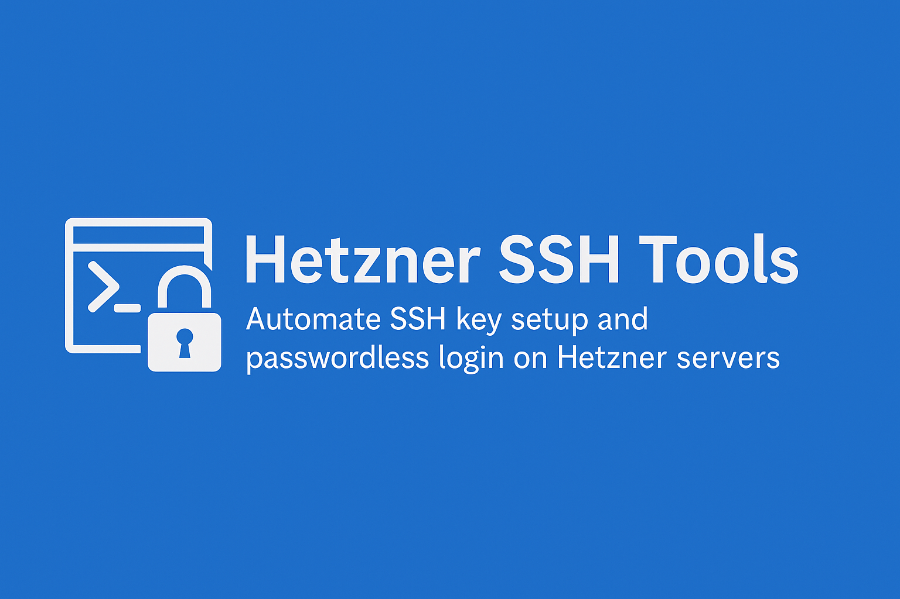

---

  

---

If you'd like to support the development of this script, you can use one of the options below:

Thank you for your support! ❤️

# Hetzner SSH Tools (Windows)

Batch-Skripte für schnelles SSH-Key-Setup und passwortlosen Zugriff auf Hetzner-Server.  
Batch scripts for quick SSH key setup and passwordless access to Hetzner servers.

---

# Deutsch

## Funktionen
- Automatische SSH-Key-Erstellung (`ed25519`)
- Public-Key-Deployment auf den Server
- Automatische Korrektur der `.ssh`-Berechtigungen
- Direktes Öffnen einer SSH-Verbindung (optional via Windows Terminal)
- Separates Quick-Connect-Skript für täglichen Login

## Skripte

### Hetzner-Setup-And-Connect.bat
- Fragt IP/Hostname und Benutzer  
- Erstellt bei Bedarf SSH-Key  
- Kopiert Public Key zu `~/.ssh/authorized_keys`  
- Startet SSH-Session  

### Hetzner-Connect.bat
- Verwendet bestehenden Key (`%USERPROFILE%\.ssh\id_ed25519`)  
- Schneller, passwortloser Login

## Voraussetzungen
- Windows 10/11  
- OpenSSH-Client  
- Optional: Windows Terminal

## Verwendung
1. Setup-Skript starten → IP/Benutzer eingeben → Passwort **einmal** → fertig  
2. Danach Connect-Skript für schnellen Login nutzen

---

# English

## Features
- Automatic SSH key generation (`ed25519`)
- Public key deployment to the server
- Automatic `.ssh` permission fixing
- Direct SSH connection (optional via Windows Terminal)
- Separate quick-connect script for daily use

## Scripts

### Hetzner-Setup-And-Connect.bat
- Asks for IP/hostname and user  
- Generates key if missing  
- Uploads public key to `~/.ssh/authorized_keys`  
- Starts SSH session  

### Hetzner-Connect.bat
- Uses existing key (`%USERPROFILE%\.ssh\id_ed25519`)  
- Fast, passwordless login

## Requirements
- Windows 10/11  
- OpenSSH Client  
- Optional: Windows Terminal

## Usage
1. Run setup script → enter IP/user → password once → done  
2. Use connect script for instant daily login

## License
MIT License
