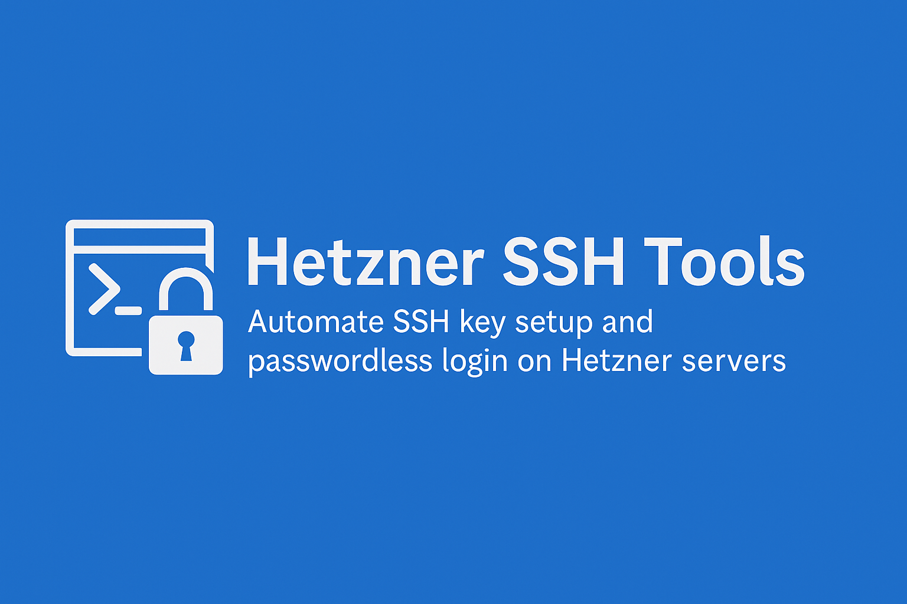

---



---

If you'd like to support the development of this script, you can use one of the options below:

[](https://hetzner.cloud/?ref=6BtzZwMqWY0Q)

Thank you for your support! ❤️

# Hetzner SSH Tools (Windows)

Batch-Skripte für schnelles SSH-Key-Setup und passwortlosen Zugriff auf Hetzner-Server.
Batch scripts for quick SSH key setup and passwordless access to Hetzner servers.

---

# Deutsch

## Funktionen

- Automatische SSH-Key-Erstellung (`ed25519`, ohne Passphrase – Hinweis siehe unten)
- Public-Key-Deployment auf den Server – **ohne doppelte Einträge** in `authorized_keys`
- Setzt korrekte Berechtigungen auf dem Server (`~/.ssh` → 700, `authorized_keys` → 600)
- Trägt den Server als **Alias in `~/.ssh/config`** ein → danach reicht überall `ssh ALIAS` (auch für `scp`, `rsync`, VS Code Remote-SSH)
- Akzeptiert neue Host-Keys automatisch beim ersten Verbinden (`StrictHostKeyChecking=accept-new`)
- Optionales Öffnen der Verbindung im Windows Terminal
- Separates Quick-Connect-Skript für den täglichen Login

## Skripte

### Hetzner-Setup-And-Connect.bat

- Fragt IP/Hostname, Benutzer und einen Alias ab
- Erstellt bei Bedarf einen SSH-Key
- Kopiert den Public Key nach `~/.ssh/authorized_keys` (idempotent – mehrfaches Ausführen erzeugt keine Duplikate)
- Schreibt einen `Host`-Block in `~/.ssh/config`
- Startet die SSH-Session

### Hetzner-Connect.bat

- Zeigt alle konfigurierten Aliasse aus `~/.ssh/config` an
- Verbindet per `ssh ALIAS` (oder direkt per IP/Hostname)

## Voraussetzungen

- Windows 10/11
- OpenSSH-Client (Einstellungen → Apps → Optionale Features)
- Optional: Windows Terminal

## Verwendung

1. Setup-Skript starten → IP, Benutzer und Alias eingeben → Passwort **einmal** → fertig
2. Danach reicht überall einfach: `ssh ALIAS`

## Tipp: Neue Hetzner-Server

Bei **Hetzner Cloud** kannst du deinen Public Key (`%USERPROFILE%\.ssh\id_ed25519.pub`) schon beim Erstellen des Servers hinterlegen (Cloud Console → SSH-Keys, oder via `hcloud`-CLI). Dann brauchst du nie ein Passwort. Dieses Skript ist der Weg für Server, die bereits laufen.

## Sicherheitshinweis

Der Key wird ohne Passphrase erstellt (bequemer täglicher Login). Das bedeutet: Wer Zugriff auf deinen Windows-Account hat, kann den Key nutzen. Nachträglich absichern mit:

```
ssh-keygen -p -f %USERPROFILE%\.ssh\id_ed25519
```

Auf dem Server empfohlen (`/etc/ssh/sshd_config`):

```
PasswordAuthentication no
PermitRootLogin prohibit-password
```

Danach: `systemctl reload sshd`

---

# English

## Features

- Automatic SSH key generation (`ed25519`, no passphrase – see note below)
- Public key deployment to the server – **without duplicate entries** in `authorized_keys`
- Sets correct permissions on the server (`~/.ssh` → 700, `authorized_keys` → 600)
- Adds the server as an **alias in `~/.ssh/config`** → afterwards a simple `ssh ALIAS` works everywhere (also for `scp`, `rsync`, VS Code Remote-SSH)
- Automatically accepts new host keys on first connect (`StrictHostKeyChecking=accept-new`)
- Optionally opens the connection in Windows Terminal
- Separate quick-connect script for daily use

## Scripts

### Hetzner-Setup-And-Connect.bat

- Asks for IP/hostname, user, and an alias
- Generates a key if missing
- Uploads the public key to `~/.ssh/authorized_keys` (idempotent – running it twice won't create duplicates)
- Writes a `Host` block to `~/.ssh/config`
- Starts the SSH session

### Hetzner-Connect.bat

- Lists all configured aliases from `~/.ssh/config`
- Connects via `ssh ALIAS` (or directly via IP/hostname)

## Requirements

- Windows 10/11
- OpenSSH Client (Settings → Apps → Optional Features)
- Optional: Windows Terminal

## Usage

1. Run the setup script → enter IP, user, and alias → password **once** → done
2. From then on, simply: `ssh ALIAS`

## Tip: New Hetzner servers

With **Hetzner Cloud** you can add your public key (`%USERPROFILE%\.ssh\id_ed25519.pub`) when creating the server (Cloud Console → SSH Keys, or via the `hcloud` CLI). Then you'll never need a password at all. This script is the way to go for servers that are already running.

## Security note

The key is generated without a passphrase (for convenient daily login). This means anyone with access to your Windows account can use the key. To add a passphrase later:

```
ssh-keygen -p -f %USERPROFILE%\.ssh\id_ed25519
```

Recommended on the server (`/etc/ssh/sshd_config`):

```
PasswordAuthentication no
PermitRootLogin prohibit-password
```

Then: `systemctl reload sshd`

## License

MIT License
